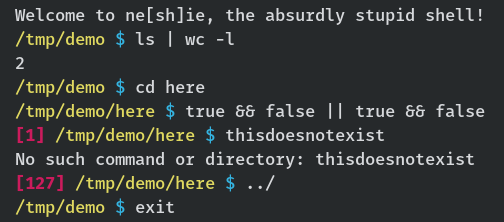

# Ne[sh]ie


_The absurdly stupid shell_

Minimal shell written in C.



## Features

+ [x] Fork and execute commands
+ [x] `cd` with builtin or by typing a folder name
+ [x] Piping
+ [x] Multiple statements terminated by `;`
+ [x] Conditional execution with `&&` and `||`
+ [ ] History (at least as builtin)
+ [ ] Variables
+ [ ] Some keybinds (requires raw mode + rework of input code)

## Requirements

Nessie depends on nothing but the tools required to build it – `make` and a C compiler – and some regular Linux syscalls.

Running the tests requires `bats` and/or `clang`.

Producing the man page requires `pandoc` – this is only done in the `make install` target.

## Installation

Run `make install` or `make install-local`. Alternatively, simply run `make` and put the binary wherever you want.

You should now be able to execute `nessie` as a regular command, or run the binary with `./nessie`.

## Testing

Run unit tests with `make test` or fuzzer tests with `make fuzz`.

## Grammar

Nessie's grammar is pretty minimal for the time being

```
LINE      := STATEMENT [; STATEMENT]*
STATEMENT := COMMAND
           | COMMAND && STATEMENT
           | COMMAND || STATEMENT
COMMAND   := PROG [ARG]* [| COMMAND]*
PROG, ARG := WORD
           | "WORD [WORD]*"
WORD      := <just continuous text>
```

## Resources used

+ Linux manual pages for various C functions
+ _The C Programming Language_ by Brian W. Kernighan and Dennis M. Ritchie
+ [This stackoverflow answer](https://stackoverflow.com/questions/33884291/pipes-dup2-and-exec) to a question about piping in C
